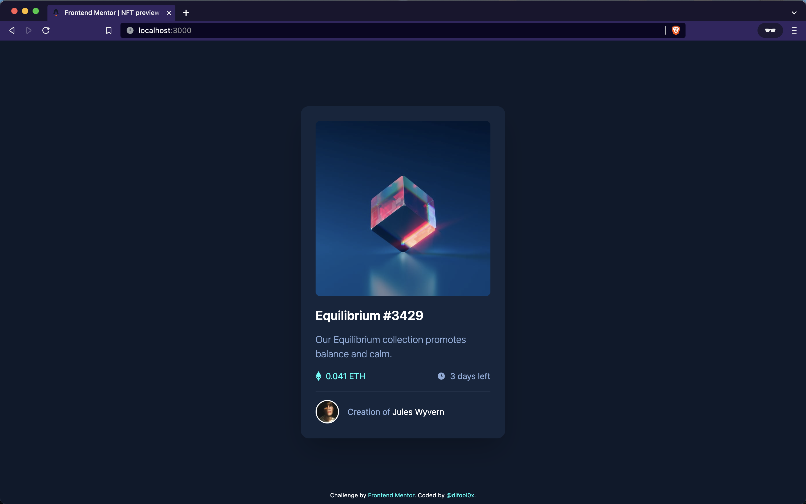

# Frontend Mentor - NFT preview card component solution

This is a solution to the [NFT preview card component challenge on Frontend Mentor](https://www.frontendmentor.io/challenges/nft-preview-card-component-SbdUL_w0U). Frontend Mentor challenges help you improve your coding skills by building realistic projects.

## Table of contents

-   [Overview](#overview)
    -   [The challenge](#the-challenge)
    -   [Screenshot](#screenshot)
    -   [Links](#links)
-   [My process](#my-process)
    -   [Built with](#built-with)
    -   [What I learned](#what-i-learned)
    -   [Continued development](#continued-development)
-   [Author](#author)

## Overview

### The challenge

Users should be able to:

-   View the optimal layout depending on their device's screen size
-   See hover states for interactive elements

### Screenshot



### Links

-   Solution URL: [github.com/difooldevs/nft-preview-card-component](https://github.com/difooldevs/nft-preview-card-component)
-   Live Site URL: [nft-prvw-component.netlify.app](https://nft-prvw-component.netlify.app/)

## My process

### Built with

-   [Astro](https://astro.build) - Static Site Generator
-   [Tailwind](https://tailwindcss.com) - CSS Framework
-   [Piccalilli CSS Reset](https://piccalil.li/blog/a-modern-css-reset/) - Modern CSS reset by Andy Bell

### What I learned

Learned how to bootstrap a project with Astro and stack it with Tailwind CSS framework. I added custom colors to Tailwind theme for the first time by modifying the tailwind.config file. See below:

```js
theme: {
		colors: {
			'primary-soft-blue': 'hsl(215, 51%, 70%)',
			'primary-cyan': 'hsl(178, 100%, 50%)',
			'dark-blue-main': 'hsl(217, 54%, 11%)',
			'dark-blue-card': 'hsl(216, 50%, 16%)',
			'dark-blue-line': 'hsl(215, 32%, 27%)',
		},
	},
```

### Continued development

Although Astro was overkill for this project, I enjoyed using it and will continue to do so. It is a lightweight static site generator that will allow me to use React framework, but not require it.

## Author

-   Website - [difool.dev](difool.dev)
-   Frontend Mentor - [@difooldevs](https://www.frontendmentor.io/profile/difooldevs)
-   Twitter - [@difool0x](https://www.twitter.com/difool0x)
